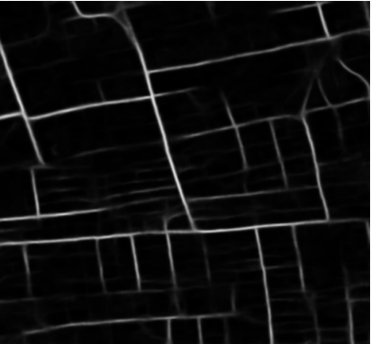
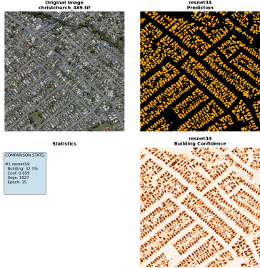
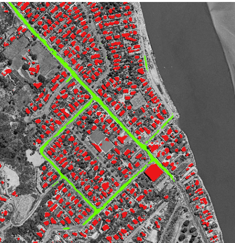
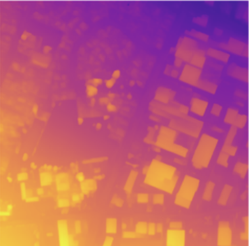
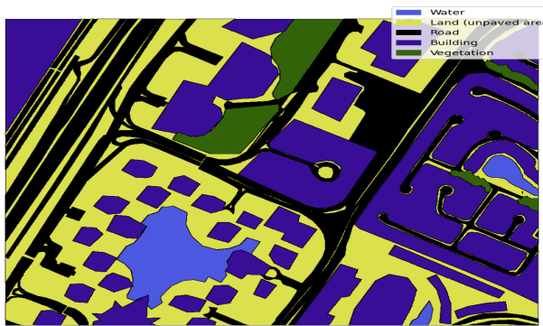

# AutoScene

AutoScene is a project for 3D scene reconstruction and building segmentation from geospatial data. It processes input files such as satellite images, depth maps, and semantic masks to generate 3D models and perform building analysis.


## Features

- Building segmentation and dataset cleaning
- 3D scene reconstruction and extrusion
- Combined processing pipeline
- Support for geospatial raster and numpy data

## Modules Used

- **Segmentation Models PyTorch**  
   [Documentation](https://segmentation-modelspytorch.readthedocs.io/en/latest)


## Datasets Used

- **AIRS: Aerial Imagery for Roof Segmentation**  
   [Kaggle Dataset](https://www.kaggle.com/datasets/atilol/aerialimageryforroofsegmentation)
- **DeepGlobe Road Extraction Dataset**  
   [Kaggle Dataset](https://www.kaggle.com/datasets/balraj98/deepglobe-road-extraction-dataset)
- **Massachusetts Roads Dataset**  
   [Kaggle Dataset](https://www.kaggle.com/datasets/balraj98/massachusetts-roads-dataset)

## Output Previews

<div align="center">
   
   <br><em>Weighted Road Segmentation Output</em>
</div>

---
Building segmentation isolates structures from satellite imagery, producing a binary or multi-class mask where buildings are clearly marked.

<div align="center">
   
   <br><em>Building Segmentation Output</em>
</div>

---
The combined image overlays road and building masks on the original input, providing a comprehensive view of detected features.

<div align="center">
   
   <br><em>Combined Output</em>
</div>

---
The depth map represents elevation or height information for each pixel, used in 3D reconstruction and analysis.

<div align="center">
   
   <br><em>Depth Map Output</em>
</div>

---
Vector mapping converts raster masks into vector shapes (polygons/lines), enabling GIS analysis and further processing.

<div align="center">
   
   <br><em>Vector Mapping Output</em>
</div>

---
The final 3D reconstruction visualizes buildings and roads in a three-dimensional space, generated from elevation and segmentation data.

<div align="center">
   
   <br><em>3D Scene Reconstruction Output</em>
</div>
# AutoScene

AutoScene is a Python-based toolkit for 3D scene reconstruction and building segmentation from geospatial data. It processes input files such as satellite images, depth maps, and semantic masks to generate 3D models and perform building analysis.

- Building segmentation and dataset cleaning
- Combined processing pipeline


## Getting Started
1. **Clone the repository:**
    ```powershell
    git clone https://github.com/Sameerbeedi/AutoScene.git
    cd AutoScene
    ```
2. **Install dependencies:**
    (List required Python packages in `requirements.txt` if available)
    ```powershell
    pip install -r requirements.txt
    ```
3. **Prepare input data:**
    Place your `.tif`, `.npy`, and mask files in the `input/` directory.
4. **Run scripts:**
    - For road segmentation:
       ```powershell
       python segmentation_train.py
       ```
    - For building segmentation:
       ```powershell
       python building/buildings.py
       ```
    - For 3D scene reconstruction:
       ```powershell
       python extrusion/main.py
       ```
    - For combined processing:
       ```powershell
       python Combined/combined.py
       ```

## Usage
- Modify the input files in the `input/` directory as needed.
- Adjust parameters in the scripts for custom processing.


## Contributing
Pull requests are welcome. For major changes, please open an issue first to discuss what you would like to change.
